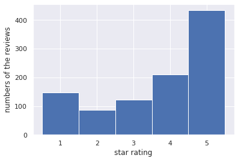

# Business review text analysis

### Result

General rating situations of business reviews

Based on the histogram of the star rating, user elevations are divided. In 1000 reviews, most users gave 5 stars to the business services, which means that they were very satisfied with the business, following by 200 users rated the business 4 stars. In opposite, quite a lot of people were unsatisfied with the business services and gave 1 star.
To observe the correlation between features (cool, funny, useful) and feature-labels( stars), a pair plot was generated. “cool” has a weak positive correlation with “stars” while “funny” and “useful” both have week negative correlation with “stars”. Besides, the features themselves have a positive correlation with each other. 

The wordcloud plot of high rating reviews shows that users frequently use “great” , “good” “like” such positive words to express their satisfaction, and they like to mentions “place”,” food”,” service”  objects. 

Dimensionality Reduction
I standardized the data set firstly. Then I applied PCA, plotted the variance explained by component. From the following first plot, we can see that nearly 107 PCA components are needed to reconstruct 50% of the original data.200 PCA components can reconstruct nearly 70% of variance. The following second plot visualizes data points in a scatter plot using the first two PCs x1 and x2 as features. We can see that most of data points are concentrated around 0-20.

Overall, compared to three figures, Huber regression adapting PCA has the best performance. 

I used  the training set to fit a model then use the model to predict the labels for the test set. I plotted a confusion matrix to compare the prediction and truth (please see the heatmap below)

I run k-means for increasing values of 𝑘 until the clustering error is below a prescribed level. Besides, I repeated k-means 50 times. Each repetition time,  I used k=12 clusters, inter=100 interaction and then stored clustering error and results. Here I plotted the clustering error.

I divided the reviews into 12 clusters. I plotted the wordcloud of each cluster and divided them into two bigger groups called “most” and “few”.

